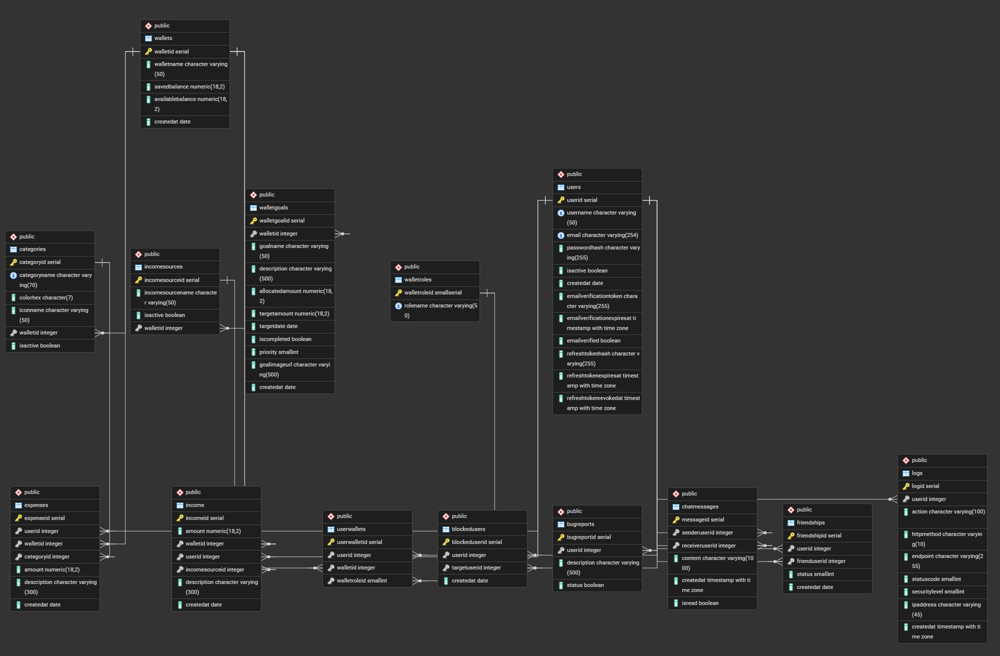

# 💰 FinanceTracker API

A secure and scalable REST API for managing personal finances through virtual wallets, shared budgets, and savings goals.

Built with ASP.NET Core 8, PostgreSQL, JWT authentication, role-based authorization, and real-time activity tracking.

---

## ✨ Features

### 👛 Wallet System

- Create and manage wallets
- Track balances
- Multi-wallet support

### 👥 Shared Wallets

- Invite users
- Roles: Owner / Editor / Viewer

### 🎯 Savings Goals

- Create goals and track progress

### 💸 Transactions

- Income & expenses tracking
- Categorization

---

### 🔐 Authentication

- JWT access + refresh tokens
- Email verification system
- BCrypt password hashing
- Role-based authorization

---

### 🛡️ System Features

- Rate limiting
- Global exception handling middleware
- Activity logging (filters)
- CORS configured
- HTTPS enforced

---

### 🖼️ Media

- Cloudinary image uploads

---

### 🧪 Testing

- xUnit
- Moq
- FluentAssertions

---

## 🧱 Tech Stack

- ASP.NET Core 8
- PostgreSQL
- Entity Framework Core
- JWT Bearer Authentication
- MailKit SMTP
- Cloudinary
- Swagger

---

## 🗄️ Database Schema



## 🚀 Getting Started

This project uses a database-first approach with PostgreSQL. The database schema is already provided and must be restored before running the application.

---

### 📌 1. Clone repository

```bash
git clone https://github.com/AhmedAlboushi/FinanceTracker.git

```

---

### ⚙️ 2. Configure environment

Rename:

appsettings.example.json → appsettings.json

---

### 🧱 3. Create database

1. Create a PostgreSQL database
2. Restore the schema using the provided SQL backup
3. Update the connection string in `appsettings.json`
4. Update connection string:
   {
   "ConnectionStrings": {
   "FinanceTrackerLocalDb": "Host=localhost;Database=FinanceTrackerDb;Username=postgres;Password=your_password"
   }
   }

---

### ▶️ 4. Run project

```bash
dotnet run
```

or press F5 in Visual Studio.

---

### 📖 5. Swagger

https://localhost:7061/swagger

---

## ⚠️ Important: First-time login setup

Users must verify email before login.

---

### 🔓 Dev bypass (no SMTP needed)

1. Register via /api/auth/register
2. Open pgAdmin
3. Run:

UPDATE "Users"
SET "IsVerified" = true,
"IsActive" = true
WHERE "Email" = 'your-email@example.com';

Now login works and JWT is issued.

---
